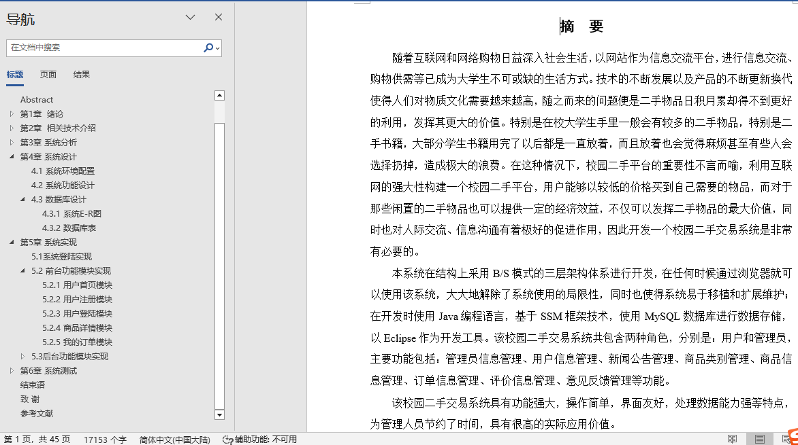
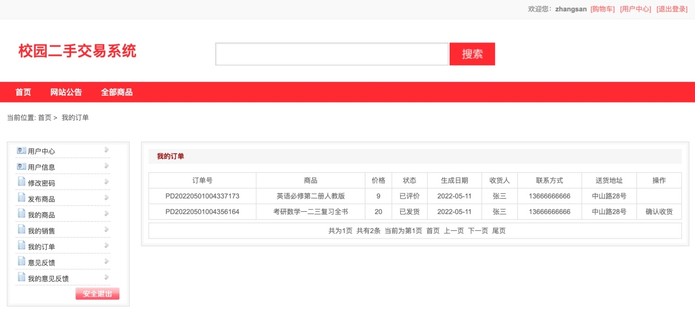
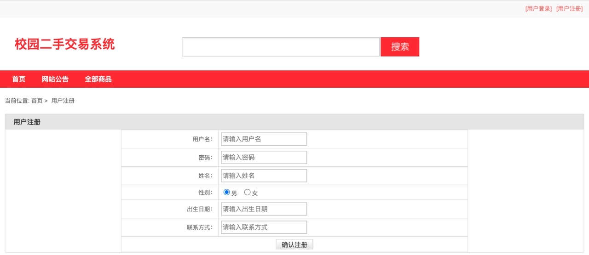
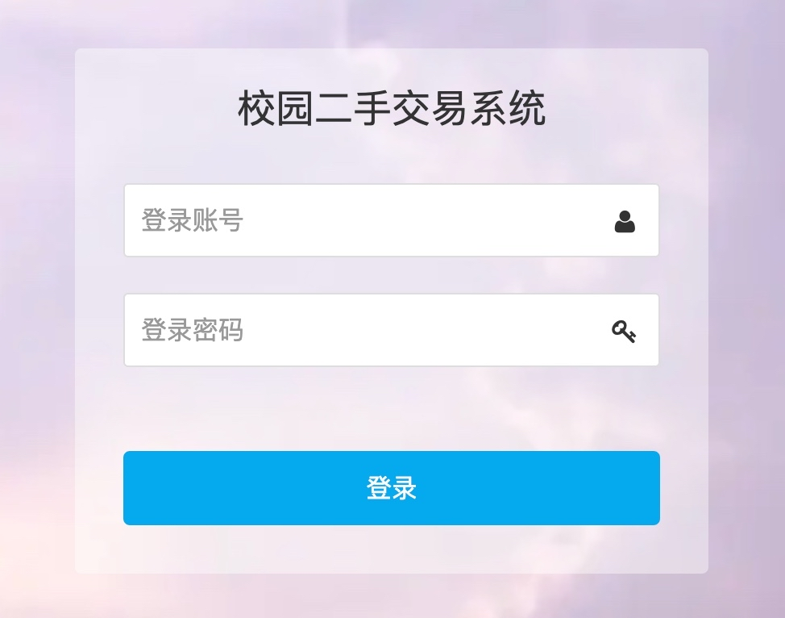
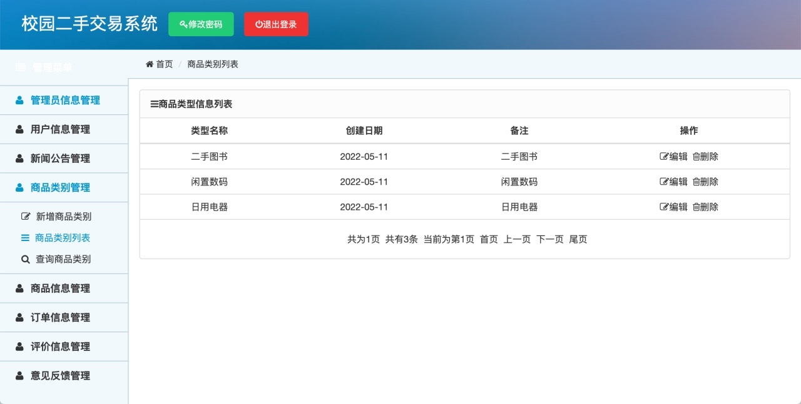
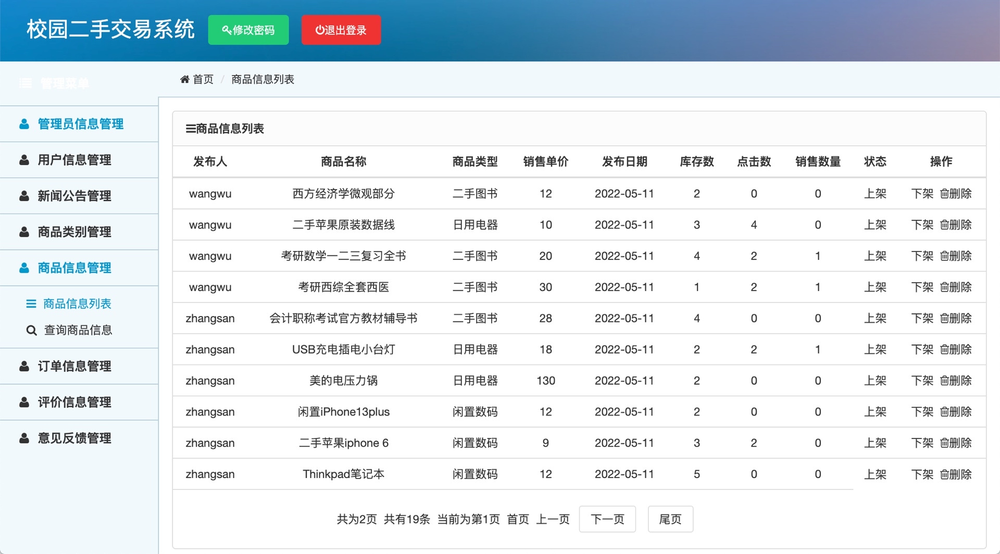
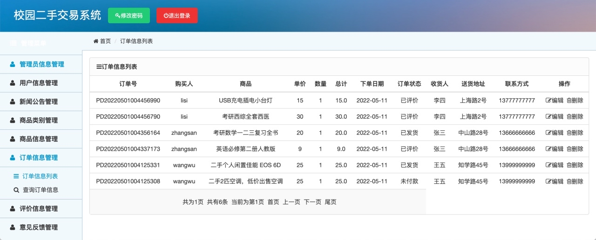
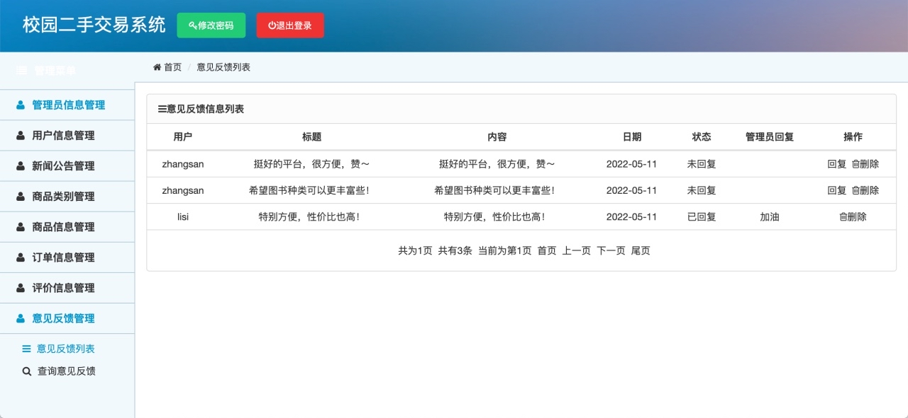
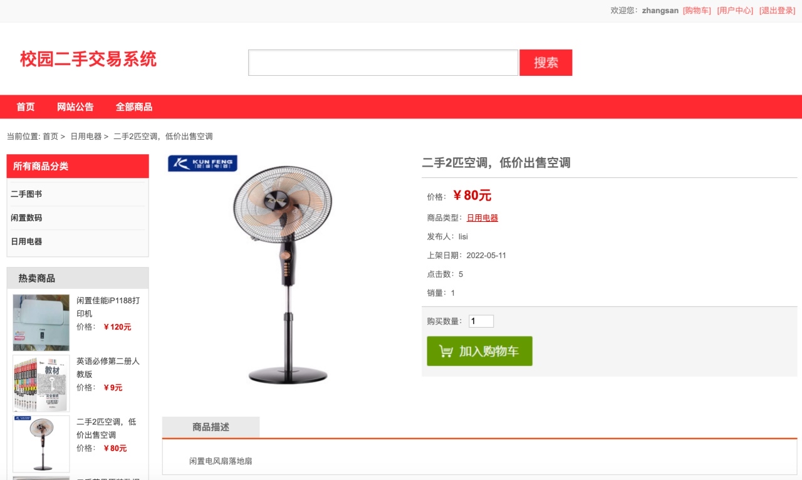

## 基于SSM框架的校园二手交易系统(程序+报告)

- <b>完整代码获取地址：从戎源码网 ([https://armycodes.com/](https://armycodes.com/))</b>
- <b>技术探讨、资料分享，请加QQ群：692619798</b> 
- <b>作者微信：19941326836  QQ：952045282</b> 
- <b>承接计算机毕业设计、Java毕业设计、Python毕业设计、深度学习、机器学习</b>
- <b>选题+开题报告+任务书+程序定制+安装调试+论文+答辩ppt 一条龙服务</b>
- <b>所有选题地址 ([https://github.com/YuLin-Coder/AllProjectCatalog](https://github.com/YuLin-Coder/AllProjectCatalog)) </b>

## 项目介绍
基于SSM框架的校园二手交易系统，主要分为前台和后台两大模块，共包含两种角色，分别是：用户和管理员。主要功能如下

1.前台功能模块

前台首页、网站公告、商品分类展示、商品搜索、商品详情、加入购物车、支付购买、用户注册、用户登录、个人中心、发布商品、我的商品、我的销售、我的订单、意见反馈、修改密码等功能。

2.后台管理模块

系统后台登陆、管理员信息管理、用户信息管理、新闻公告管理、商品类别管理、商品信息管理、订单信息管理、评价信息管理、意见反馈管理等功能。

## 项目技术
- 编程语言：Java
- 数据库：MySQL
- 前端技术：UI界面：JSP、jQuery、H-ui
- 后端技术：Spring、SpringMVC、MyBatis

## 运行环境
- JDK版本：JDK1.8及以上
- 开发工具：IDEA、Ecplise、Myecplise都可以
- 数据库: MySQL5.7及以上

## 运行截图

